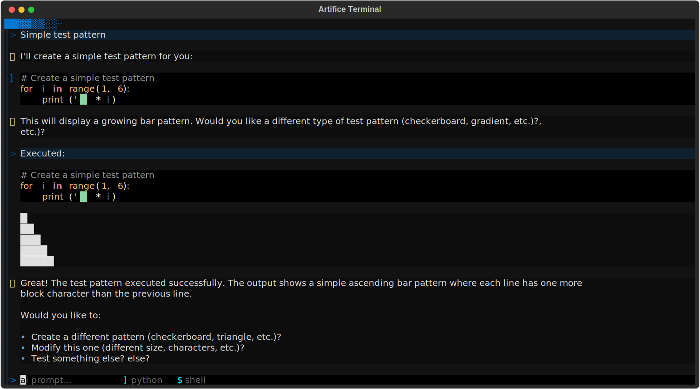

# Artifice

An interactive coding environment with human-in-the-loop AI assistance. Artifice combines a Python REPL, shell access, and AI agents into a unified terminal interface where you maintain full control over code execution.



## What is Artifice?

Artifice is a prototype terminal-based (TUI) coding assistant built with [Textual](https://github.com/Textualize/textual). Unlike traditional AI coding tools that execute code automatically, Artifice shows you every action an AI agent wants to take and lets you approve, modify, or reject it before execution. This creates a collaborative environment where AI suggestions enhance your workflow without removing you from the taking skillful actions.

## Quick Start

### Prerequisites

- Python 3.8 or higher
- pip for package installation
- (Optional) Anthropic API key for AI features

### Installation

Install with AI support:
```bash
pip install -e ".[ai]"
```

For basic usage without AI features:
```bash
pip install -e .
```

### Configuration

Set your API key for AI features:
```bash
export ANTHROPIC_API_KEY="your-api-key-here"
```

### Running

```bash
artifice
```

## Usage

### Mode Switching

Artifice has three input modes. Switch modes by typing a special character when the input is empty:

- `?` - **AI Agent mode** - Ask questions and get AI assistance
- `>` - **Python mode** - Execute Python code interactively
- `!` - **Shell mode** - Run shell commands

### Example: Python Session

```
> x = [1, 2, 3, 4, 5]
> sum(x)
15
```

### Example: AI Interaction

```
? What's the average of the list x?
```

The AI might suggest:
```python
sum(x) / len(x)
```

You'll see the proposed code and can choose to execute it, modify it, or skip it.

### Example: Shell Commands

```
! ls -la
! git status
```

## Features

### Core Features
- **Interactive Python Console** - Full REPL with persistent session
- **Interactive Shell** - Execute shell commands without leaving the environment
- **Markdown Rendering** - AI responses rendered with syntax highlighting
- **Multiline Input** - Write complex code with Python auto-complete
- **Command History** - Persistent history across sessions

### Block Navigation
- **Ctrl+Up/Down** - Navigate between previous inputs and outputs (blocks)
- **Pin Blocks** - Mark important code/response/output blocks for easy reference
- **Edit Blocks** - Modify and re-execute previous inputs
- **Save/Restore** - Persist important blocks across sessions

### AI Agent Integration
- **Tool Calling** - AI can propose Python code or shell commands
- **Agentic Loops** - Multiple tool calls in a single conversation
- **Human Approval** - Review every action before execution
- **Persistent Context** - AI sees your session state and history
- **Visual Feedback** - Tool calls and results displayed in the UI

## Keybindings

- **Ctrl+Up/Down** - Navigate through blocks
- **Enter** - Execute input
- **Ctrl+C** - Cancel current operation
- **Ctrl+D** - Exit application
- **Ctrl+O** - Toggle markdown rendering on selected block
- **Ctrl+L** - Clear

## AI Agent Integration

### Architecture

Artifice decouples AI suggestions from execution. When an AI agent makes a tool call to execute Python or shell commands, you are prompted to review the proposed action. You can:

1. **Execute** - Run the code as suggested
2. **Edit** - Modify the code before running
3. **Skip** - Reject the suggestion and continue

This design enables agentic workflows while keeping you fully responsible and in control of all code execution.

### Supported Agents

- **Claude** (via Anthropic API) - Streaming support with tool calling
- Custom agents via `AgentBase` subclass

### Running from Source

```bash
git clone <repository-url>
cd artifice 
python src/artifice/terminal.py
```

## Roadmap

Planned features and improvements:

- [ ] VIM keybinding mode for text editing
- [ ] GitHub Copilot integration
- [ ] Additional AI provider support (OpenAI, local models)
- [ ] Session export/import

